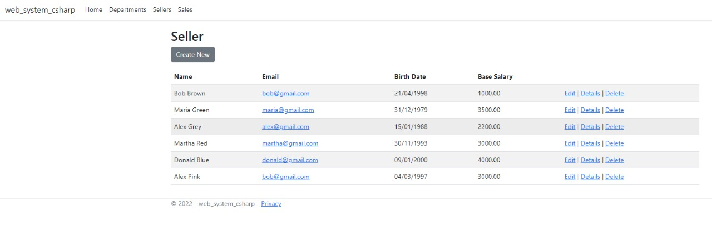
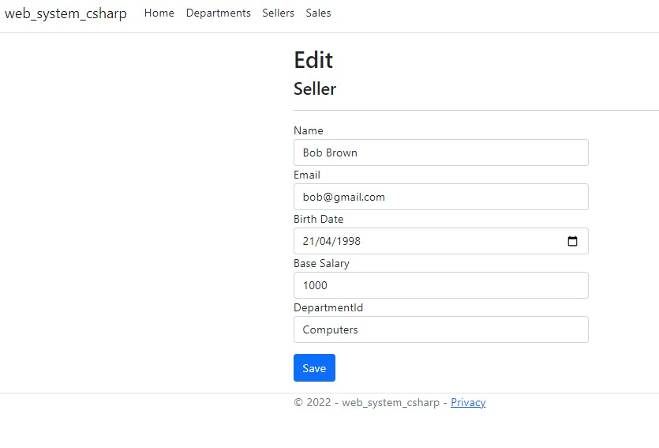
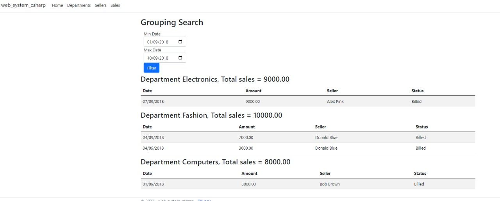

# Web sales system

- It's is basically a MVC CRUD using dotnet and following good practices learned through the course. 
- Entities created are departments, sellers that belongs to departments and sales records that belogs to sellers.
- Code along course in reference, made adaptations to use dotnet 6.0 and EntitityFrameworkCore 3.0.
- Made using C#, DOTNET, Entity Framework (Code-first aproach) and MySql.

## Snapshots

- Departments

- Sellers

- Update Sellers

- Grouped search

## References

- Course: [C# COMPLETO Programação Orientada a Objetos + Projetos - Nélio Alves](https://www.udemy.com/course/programacao-orientada-a-objetos-csharp/)
- Using command line CRUD/EntityFrameworkd: [.NET 6.0: Code First with Entity Framework Core and MySQL - Arjav Dave](https://www.daveops.co.in/post/code-first-entity-framework-core-mysql)

## Pre-requisites

- Setup MySql Local Server
- Visual Studio Code or any IDE
- CLI with dotnet

## Running

### Database
- dotnet ef migrations add MigrationName # Create migration
- dotnet ef database update # Apply migration

### Development
- dotnet compile # Check if everything is fine
- dotnet watch run # Run and wait for updates